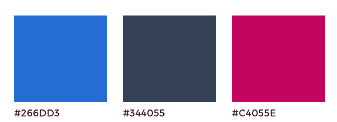
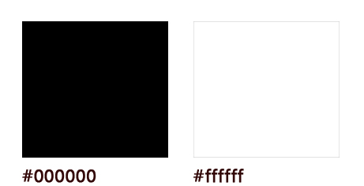

<h1>Simple Content Management System / Group Work</h1>
<h3>FEND16 : PHP, MySQL, CMS</h3>

 
<h4>Magnus Öhrström, Yoko Andrae, Martin Clavin</h4>

  
  
### Beskrivning om uppgiften
Uppdraget är att skapa en blogg applikation skriven i PHP och MySQL som fungerar som ett mindre CMS där man kan lägga till, redigera och ta bort innehåll. Den ska även möjliggöra rösta eller gilla innehållet.

### Arbetsflöde
Vi satte igång detta uppdrag med namngivning till vår grupp/projekt. Vi strukturerade sedan vår databas (bestämde vilka tabeller och kolumner krävdes), och därefter diskterade vi om tema färger och typsnitt. För att köra igång kodning, delade vi upp uppdraget till tre olika delar: **1) Signup/login system, 2) blogg inläggnings system,** samt **3) like/comments system**. Magnus byggde ett skellet (med CSS styles) av webbsidan, och sedan lade vi in var sin kod till detta skellet.  
  
Flesta våra kommunikationer skedde på Slack, samt vi samlade in i klassrummet när det var möjligt. Vi körde dessutom scrum-möte ett par gånger i veckan. Vi hanterade versioner och hämtade filer av varandra genom GitHub.  
  
Utmaningar till denna uppgift var att man skulle skicka data med AJAX, och lägga upp datan på webbsidan eller gömma beroende på kriterier (dvs tillagt flera if-satser på php-filerna) där man krävdes att förstå hur och vilka data skulle skickas med och hämtas. Man skulle dessutom använda klasser vilka som fattas i vårt javascript. Vi försörkte kapsla in funktionaliteter med klass-metoder för att åstadkomma "Dependency Injections".  
  
### Huvudsakliga roller
- Magnus
    - Styling (CSS)
    - Like system
 - Yoko
    - Sign up / login system
- Martin
    - Posting system
  

### Viktiga punkter
Vår CMS applikation har en tydlig struktur och därmed ett enkelt utseende. Den har ingen admin-sida utan är en "single page" applikation. När man låggar in som Admin, då kommer headern att förändras i färgen till blå, samt amin rättgheten tillgänglig.    
  
**Sign-up systemet** låter användare att skriva in med obligatoriska username och låsenord, och firstname och lastname är valfria. När man kommit in, headern visar username så att användaren vet att han/hon är in på sidan. Javascript validerar om alla obligatoriska fält är fyllda och låsenord stämmer med andra vid sign-up. När det godkänner så skickar scriptet datan till PHP. PHP validerar då användarnamnet inte finns i databasen. Vid login systemet, validerar Javascript om alla fält är fyllda och skickar vidare till PHP när dessa är godkännda, och då PHP validerar användarnamn och låsenord stämmer samt retunerar boolean för admin rättigheten.  
  
**Post systemet**  
<<<<<< Martin skriver >>>>>>
  
**Like systemet**  
<<<<<< Magnus skriver >>>>>>
  

  
### Style Guide
#### Tema-färger

#### Typsnitt
Abel, Sans-serif (Headers & Titles)  
Playfair Display, Serif (Subsidiary Texts )

|  Working Area | Tools & Technologies |
|:-----:|:-----:|
|Style Guide|Photoshop|
|Stylesheet|Sass|
|Data Transform between files|jQuery, Ajax|
|Library|Bootstrap|
|Communication|Slack, Trello, Google Drive|
|Vergion Controll|Git, GitHub|

  
### Källor
Gif Loader Animation: http://www.ajaxload.info/  
Google Fonts: https://fonts.google.com/